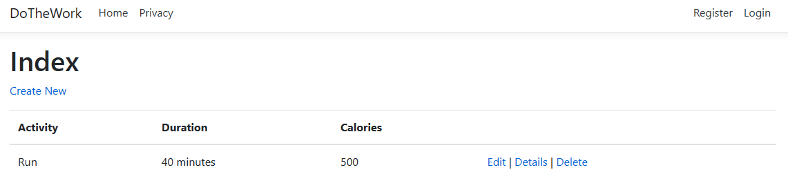
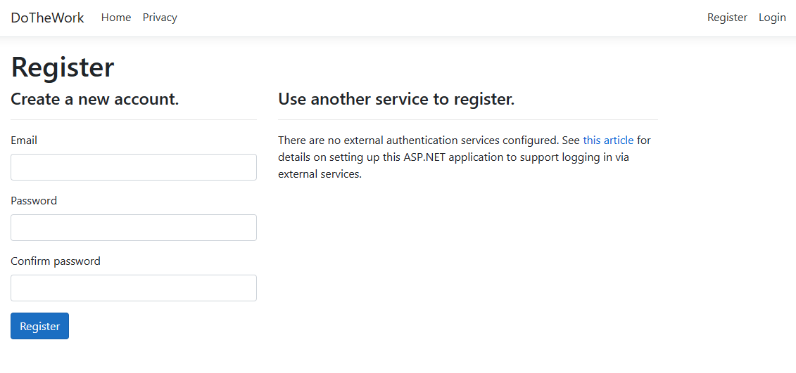

# 🏋️‍♀️ Workout Logger Web Application

Welcome to **Workout Logger**, the ultimate workout tracking solution! 🚀

## 🌟 Features

- 💪 Log and track your workouts effortlessly.
- 🎯 MVC design patterns for organized code structure.
- 🛠️ Built with ASP.NET, Entity Framework, and Razor forms.
- 🎨 Customize UI with CSS and Bootstrap classes.
- 🔍 Quick search functionality for finding past workouts.
- 🔐 Secure user authentication for data privacy.
- 📊 Utilizes SQL database to store and manage workout data.

## Prerequisites

Before you begin, make sure you have the following:

- [Visual Studio 2019](https://visualstudio.microsoft.com/vs/) with ASP.NET MVC installed.
- [.NET Core 3.1.](https://dotnet.microsoft.com/download/dotnet-core/3.1) installed.

## 🚀 Getting Started

1. Clone the repository: `git clone https://github.com/yourusername/WorkoutLogs.git`
2. Open the solution in Visual Studio 2019: `start .\WorkoutLogs\DoTheWork.csproj`

3. Open the Package Manager Console and install dependancies with `dotnet restore`
4. Package Manager Console can be opened by searching it in the top search bar
5. Ensure database is updated by running the following in the Package Manager Console: `update-database`
6. Run the project by clicking the play button next to IIS Express at the top

## 📸 Screenshots

## 🤝 Contributing

Contributions are welcome! Just fork this repository, create a new branch, commit your changes, and submit a pull request. Let's make this app even better together! 🤗

---

Created with ❤️ by [Miguel](https://github.com/Miguel619)
